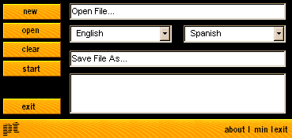



## VB Project Lingual Translator

### Description

3:39 PM 12/10/00

Visual Basic Project Translator [From the maker of RosettaStone2]-- Are you sick of making different programs to appease different cultures with different languages? Well, not any more. VBpt2 will translate your VB files (project, mods, forms, etc,...) to the languages you want, choosing from directories filled with almost 100,000 words. With an easy to use interface, VBpt2 is sure to be a time-saving utility that works for you.
 
### More Info
 

             |
---                |---
**Submitted On**   |2000-12-10 17:57:06
**By**             |[MidWestEspresso](https://github.com/Planet-Source-Code/PSCIndex/blob/master/ByAuthor/midwestespresso.md)
**Level**          |Advanced
**User Rating**    |5.0 (10 globes from 2 users)
**Compatibility**  |VB 5\.0, VB 6\.0
**Category**       |[Complete Applications](https://github.com/Planet-Source-Code/PSCIndex/blob/master/ByCategory/complete-applications__1-27.md)
**World**          |[Visual Basic](https://github.com/Planet-Source-Code/PSCIndex/blob/master/ByWorld/visual-basic.md)
**Archive File**   |[CODE\_UPLOAD1263312122000\.zip](https://github.com/Planet-Source-Code/midwestespresso-vb-project-lingual-translator__1-13484/archive/master.zip)

